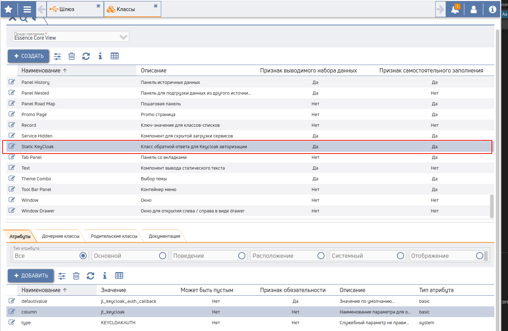

# Подключение keycloak авторизации

## 1. После регистрации Realm и Client в KeyCloak выгружаем настройки


## 2. Добавлем в представление(добавлен по умолчанию в auth) или страницу класс



## 3. Регистрируем провайдер на шлюзе


### 3.1 Мапим доступы


### 3.2 Мапим данные пользователя


## 4. Создаем пустой сервис и подключаем к кнопке, если не рекурсивный


## 5. Регистрируем admin для обратной связи keycloak

### 5.1 Добавляем location в nginx
```nginx
        location ~ "/keycloak/(.+)$" {
            proxy_pass http://gate:8080/api?jv_keycloak_path_callback=$1;
        }
```
### 5.2 Добавляем в настройки client KeyClock сервер


