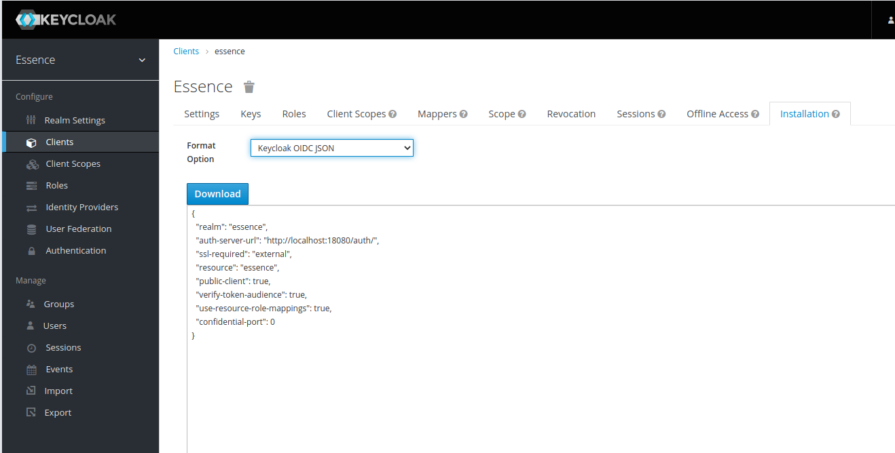
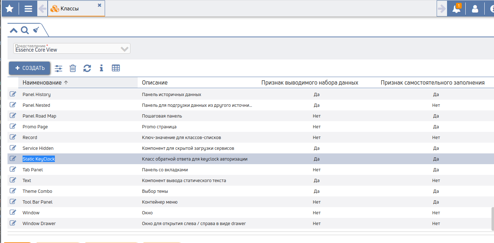
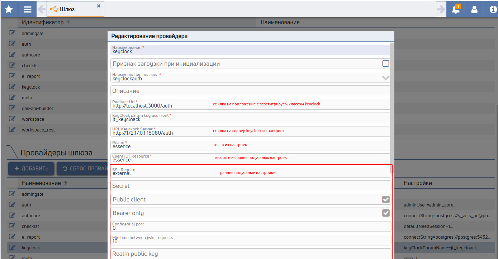
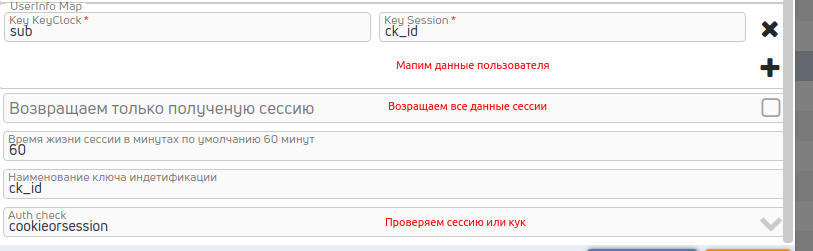

# Подключение keyclock авторизации

## 1. После регистрации Realm и Client в KeyClock выгружаем настройки



## 2. Добавлем в представление(добавлен по умолчанию в auth) или страницу класс



## 3. Регистрируем провайдер на шлюзе



### 3.1 Мапим доступы


### 3.2 Мапим данные пользователя



## 4. Регистрируем admin для обратной связи keyclock

### 4.1 Добавляем location в nginx
```nginx
        location ~ "/keyclock/(.+)$" {
            proxy_pass http://gate:8080/api?jv_keyclock_path_callback=$1;
        }
```
### 4.2 Добавляем в настройки client KeyClock сервер


